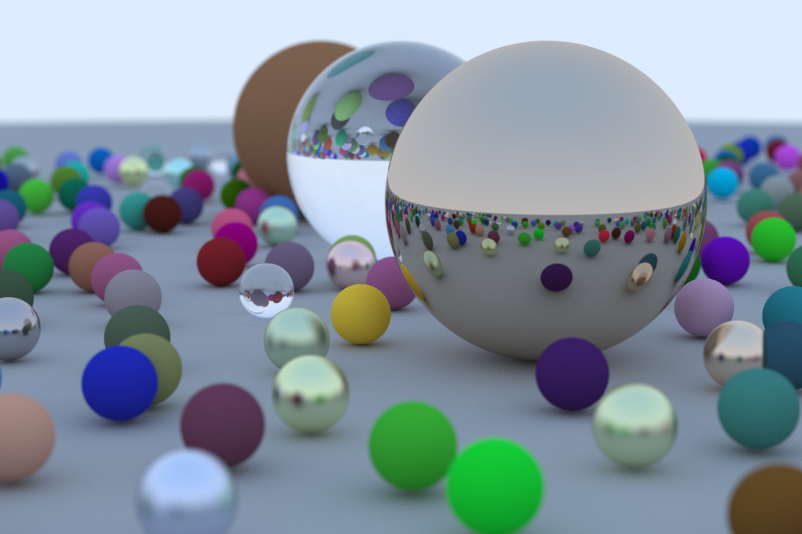

# ray-tracer

This is my implementation of the book [_Ray Tracing in One Weekend_](https://raytracing.github.io/books/RayTracingInOneWeekend.html).

## How to run it

You should definitely compile in release mode with either

`cargo run --release`

or

`cargo rustc --release -- -C target-cpu=native && ./target/release/ray-tracer`

## The final image (1200x800):

## A 4k version:

